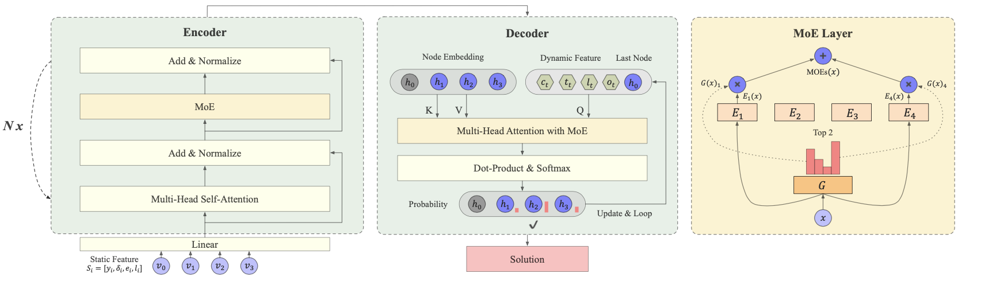
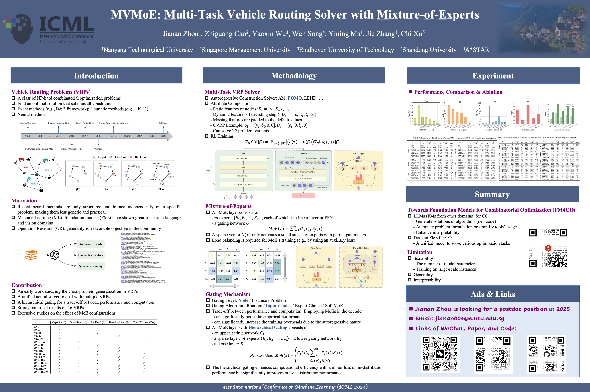

<h1 align="center"> MVMoE: Multi-Task Vehicle Routing Solver with Mixture-of-Experts </h1>

<p align="center">
      <a href="https://openreview.net/forum?id=lsQnneYa8p"></a>&nbsp;&nbsp;&nbsp;&nbsp;<a href="https://arxiv.org/pdf/2405.01029"></a>&nbsp;&nbsp;&nbsp;&nbsp;<a href=""></a>&nbsp;&nbsp;&nbsp;&nbsp;<a href="https://hits.seeyoufarm.com"></a>&nbsp;&nbsp;&nbsp;&nbsp;<a href="https://github.com/RoyalSkye/Routing-MVMoE/blob/main/LICENSE"></a>
  </p>

The PyTorch Implementation of *ICML 2024 -- [MVMoE: Multi-Task Vehicle Routing Solver with Mixture-of-Experts](https://arxiv.org/pdf/2405.01029)*. MVMoE is a unified neural solver that can cope with 16 VRP variants simultaneously, even in a zero-shot manner. Concretely, the training tasks include `CVRP`, `OVRP`, `VRPB`, `VRPL`, `VRPTW`, and `OVRPTW`. The test tasks include `OVRPB`, `OVRPL`, `VRPBL`, `VRPBTW`, `VRPLTW`, `OVRPBL`, `OVRPBTW`, `OVRPLTW`, `VRPBLTW`, and `OVRPBLTW`. 

* 🇦🇹 *We will attend ICML 2024. Welcome to stop by our poster (Session 6 @ Hall C 4-9 #1003) for discussion.*
* 🚀 *[RL4CO](https://github.com/ai4co/rl4co) adds support for MVMoE - [example](https://github.com/ai4co/rl4co/blob/main/examples/other/1-mtvrp.ipynb).*
* 🎓 *We release an awesome paper list on Foundation Model for Combinatorial Optimization - [FM4CO](https://github.com/ai4co/awesome-fm4co).*

<details>
    <summary><strong>Overview</strong></summary>
<p align="center"></p>
</details>

<details>
    <summary><strong>Poster</strong></summary>
<p align="center"></p>
</details>

## Dependencies

* Python >= 3.8
* Pytorch >= 1.12

## How to Run

<details>
    <summary><strong>Train</strong></summary>


```shell
# Default: --problem_size=100 --pomo_size=100 --gpu_id=0
# 0. POMO
python train.py --problem={PROBLEM} --model_type=SINGLE

# 1. POMO-MTL
python train.py --problem=Train_ALL --model_type=MTL

# 2. MVMoE/4E 
python train.py --problem=Train_ALL --model_type=MOE --num_experts=4 --routing_level=node --routing_method=input_choice

# 3. MVMoE/4E-L
python train.py --problem=Train_ALL --model_type=MOE_LIGHT --num_experts=4 --routing_level=node --routing_method=input_choice
```

</details>

<details>
    <summary><strong>Evaluation</strong></summary>


```shell
# 0. POMO
python test.py --problem={PROBLEM} --model_type=SINGLE --checkpoint={MODEL_PATH}

# 1. POMO-MTL
python test.py --problem=ALL --model_type=MTL --checkpoint={MODEL_PATH}

# 2. MVMoE/4E
python test.py --problem=ALL --model_type=MOE --num_experts=4 --routing_level=node --routing_method=input_choice --checkpoint={MODEL_PATH}

# 3. MVMoE/4E-L
python test.py --problem=ALL --model_type=MOE_LIGHT --num_experts=4 --routing_level=node --routing_method=input_choice --checkpoint={MODEL_PATH}

# 4. Evaluation on CVRPLIB
python test.py --problem=CVRP --model_type={MODEL_TYPE} --checkpoint={MODEL_PATH} --test_set_path=../data/CVRP-LIB
```

</details>

<details>
    <summary><strong>Baseline</strong></summary>


```shell
# 0. LKH3 - Support for ["CVRP", "OVRP", "VRPL", "VRPTW"]
python LKH_baseline.py --problem={PROBLEM} --datasets={DATASET_PATH} -n=1000 --cpus=32 -runs=1 -max_trials=10000

# 1. HGS - Support for ["CVRP", "VRPTW"]
python HGS_baseline.py --problem={PROBLEM} --datasets={DATASET_PATH} -n=1000 --cpus=32 -max_iteration=20000

# 2. OR-Tools - Support for all 16 VRP variants
python OR-Tools_baseline.py --problem={PROBLEM} --datasets={DATASET_PATH} -n=1000 --cpus=32 -timelimit=20
```

</details>


## How to Customize MoE

MoEs can be easily used in Transformer-based models by replacing a Linear/MLP with an MoE layer. The input and output dimensions are kept the same as the original layer. Below, we provide two examples of how to customize MoEs.

```python
# 0. Our implementation based on https://github.com/davidmrau/mixture-of-experts
# Supported routing levels: node/instance/problem
# Supported routing methods: input_choice/expert_choice/soft_moe/random (only for node/instance gating levels)
from MOELayer import MoE
moe_layer = MoE(input_size={INPUT_DIM}, output_size={OUTPUT_DIM}, hidden_size={HIDDEN_DIM},
                num_experts={NUM_EXPERTS}, k=2, T=1.0, noisy_gating=True, 
                routing_level="node", routing_method="input_choice", moe_model="MLP")

# 1. tutel - https://github.com/microsoft/tutel
from tutel import moe as tutel_moe
moe_layer = tutel_moe.moe_layer(
                gate_type={'type': 'top', 'k': 2},
                model_dim={INPUT_DIM},
                experts={'type': 'ffn', 'count_per_node': {NUM_EXPERTS},
                         'hidden_size_per_expert': {HIDDEN_DIM},
                         'activation_fn': lambda x: torch.nn.functional.relu(x)},
            )
```


## Citation

```tex
@inproceedings{zhou2024mvmoe,
title       ={MVMoE: Multi-Task Vehicle Routing Solver with Mixture-of-Experts},
author      ={Jianan Zhou and Zhiguang Cao and Yaoxin Wu and Wen Song and Yining Ma and Jie Zhang and Chi Xu},
booktitle   ={International Conference on Machine Learning},
year        ={2024}
}
```

## Acknowledgments

* [ICML 2024 Review](https://github.com/RoyalSkye/Routing-MVMoE/blob/main/assets/Reviews_ICML24.md)
* https://github.com/yd-kwon/POMO
* https://github.com/davidmrau/mixture-of-experts
